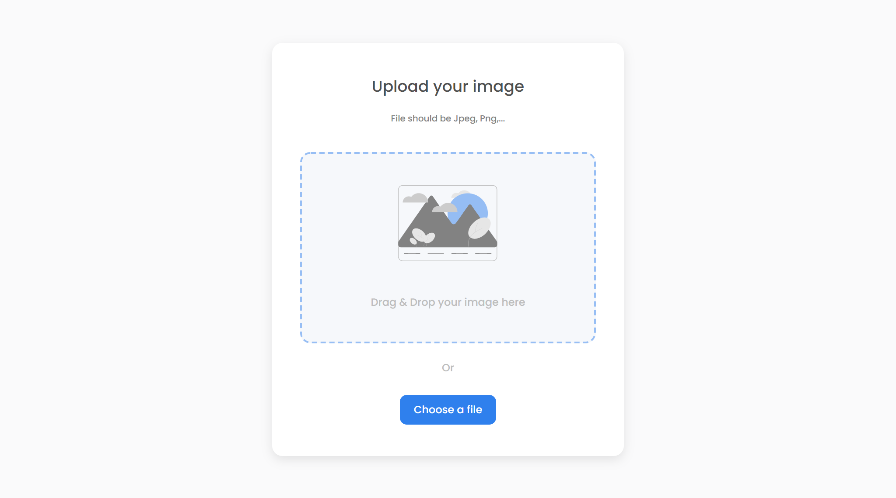

<h1 align="center">Image Uploader</h1>

<div align="center">
   Solution for a challenge from  <a href="http://devchallenges.io" target="_blank">Devchallenges.io</a>.
</div>

<div align="center">
  <h3>
    <a href="https://image-uploader-b.herokuapp.com/">
      Demo
    </a>
    <span> | </span>
    <a href="https://{your-url-to-the-solution}">
      Solution
    </a>
    <span> | </span>
    <a href="https://devchallenges.io/challenges/O2iGT9yBd6xZBrOcVirx">
      Challenge
    </a>
  </h3>
</div>

## Table of Contents

- [Overview](#overview)
  - [Built With](#built-with)
- [Features](#features)
- [How to use](#how-to-use)
- [Contact](#contact)

## Overview



This is a full-stack web application created using VueJS on the frontend and NodeJS on the backend with which you can upload any image to a server and view it from anywhere with the link that it provides you.

### Built With

- [Vue.js](https://vuejs.org/)
- [Sass](https://sass-lang.com/)
- [NodeJS](https://nodejs.org/)

## Features

This application/site was created as a submission to a [DevChallenges](https://devchallenges.io/challenges) challenge. The [challenge](https://devchallenges.io/challenges/O2iGT9yBd6xZBrOcVirx) was to build an application to complete the given user stories.

## How To Use

To clone and run this application, you'll need [Git](https://git-scm.com) and [Node.js](https://nodejs.org/en/download/) (which comes with [npm](http://npmjs.com)) installed on your computer.

To clone and install the dependencies run:

```bash
# Clone this repository
$ git clone https://github.com/BrandonSdvl/image-loader

# Install dependencies
$ npm install
```

Once you have this you can run:

```bash
# Run the Vue server
$ npm run serve
```
If you want to run Node server, you must first change the host value in App.vue
```js
// host: "https://image-uploader-b.herokuapp.com"
host: "http://localhost:3000"
```

Now you can run the Node server
```bash
# Run the Node server (this does not reload automatically the page)
$ npm run start
```

## Contact

- GitHub [@BrandonSdvl](https://github.com/BrandonSdvl)
